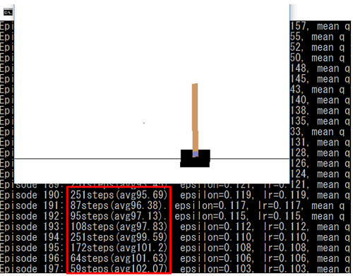
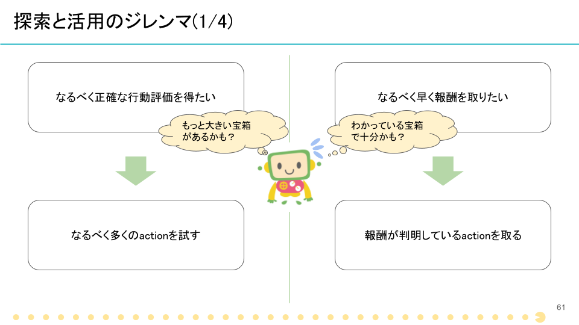
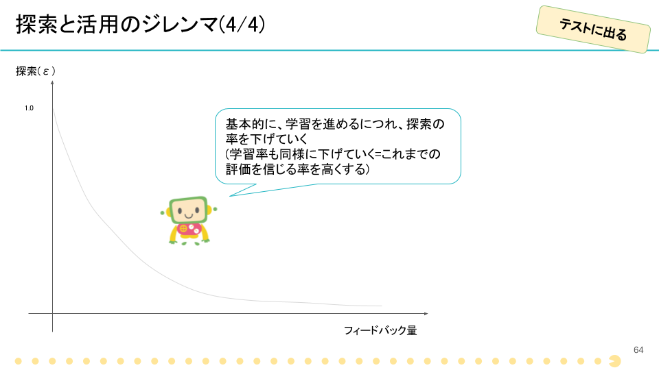

# Train Agent by Reward

今までのAgentは固定されたルールに基づいて行動をとっていましたが、ここではいよいよ強化学習を用いて学習させてみます。  
学習に使用するアルゴリズムは、Q-learningです。

学習に対象の環境は`CartPole-v0`とします。この環境での目的は、カートをうまく動かして棒がなるべく長い時間倒れないようにすることです。



赤で囲った個所の、step数(=棒をキープ出来た期間)がなるべく大きくなるように、カートの動かし方を学習させます。  

## Q-function (q.py)

はじめに、Agentの行動を評価する関数であるQ-functionを作成します。  
「行動を評価する関数」とは、具体的には「ある状態の時、どんな行動が、どれぐらいいいか」を計算するものです(出力される行動評価の値は、Q-valueと呼ばれます)。
これが上手く学習できれば、評価が最も高い行動=最適な行動となります。

## Agent (agent.py)

続いて、このQ-functionを基に行動するAgentを実装します。

Q-learningを使用する場合、Agentには探索と活用のジレンマがありました。



要は、探索のためにランダムで行動すべきか、活用のため自分で学習したQ-functionを信じて行動するか、ということです。  
このトレードオフを表現したものがε-greedy法です。具体的には、εの確率でランダムに、1-εの確率で自分を信じて行動します。

このε-greedy法を、Agentに実装しましょう。`agent.py`の中の`act`関数を、以下のように編集してください。

```python
    def act(self, observation):
        # your code here
        action = -1
        if np.random.random() < self.epsilon:
            action = np.random.choice(self.q.n_actions)
        else:
            action = np.argmax(self.q.values(observation))
        
        return action

```

* 乱数を発生させepsilon以下である場合(つまり、epsilonの確率で)、ランダムに行動します(=探索)
* epsilon以外の時は、これまでの学習結果を利用して行動を決定します(活用)
 * 先ほど定義した`Q.values`関数から得られる行動評価の中で最大のものをactionとして採用しています(argmaxは、値が最大のもののインデックスを取る関数です)。

これで、Agentの実装は終了です。

そして、学習に際してはもう一つ重要なことがありました。それは、学習が進むにつれて探索の割合、また学習率を徐々に減らしていくということです。
今回は、「減らし方」を外部から受け取るようにしています。そのため、エピソードが終了した段階で、受け取った減らし方の通りにパラメーターを調整します。

[`trainer.py`の`your code here 2`と書かれた箇所](https://github.com/icoxfog417/techcircle_openai_handson/blob/master/handson_3/trainer.py#L49)に、以下のコードを追加してください。



```python
                if self.epsilon_decay is not None:
                    self.agent.epsilon = self.epsilon_decay(self.agent.epsilon, i)
                if self.learning_rate_decay is not None:
                    lr = self.learning_rate_decay(lr, i)

```

これで学習の準備は整いました！

最後に、以下のコマンドを実行して学習がきちんと進んでいるか、確認してみてください。

```
python handson3.py --render
```

しばらくたつと、ポールをキープする時間が長くなっていくのがわかると思います。
